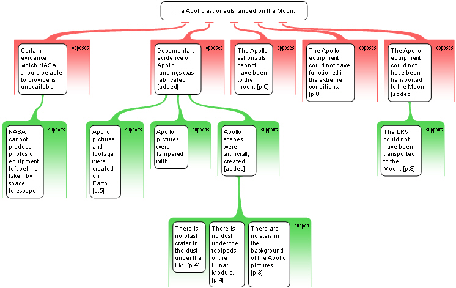
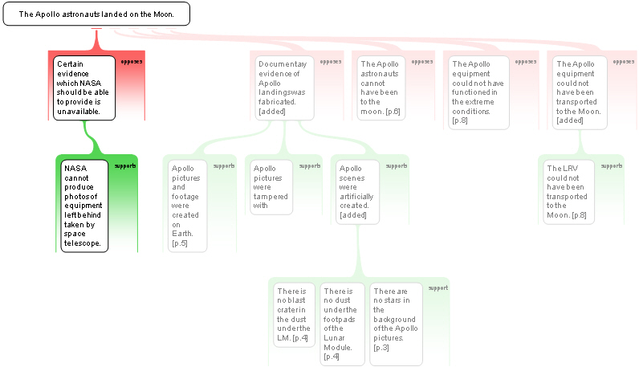

---
tags:
  - writing
  - argument term
"Type: File":
  - Note
URL: https://www.rationaleonline.com/explore/en/tutorials/tutorials/Tutorial_6/Exercises/6_3/6_3.htm
Order: "6.3"
"Type: Content":
  - Tutorial
---
# [Exercise 6.3](https://www.rationaleonline.com/explore/en/tutorials/tutorials/Tutorial_6/Exercises/6_3/6_3.htm)

Take the argument map from the model answer to Exercise 6.3 and improve it by applying the second (CE) part of the MECE rule.

#### Answer

Applying the CE part of the MECE rule results in this expanded map:

A primary objection, with supporting reason, has been added because the set of primary objections was not collectively exhaustive.

#### Discussion

Again, we should consider each of these groups individually.

#### [Group](https://app.heptabase.com/8167b54f-d61a-4931-875a-3df1e49cfc74/card/12abf7f6-a3fb-403a-a9dd-63cc45bd4f61) 1

Recall that the CE part of the MECE rule says that a group should be Collectively Exhaustive, i.e., should include all the relevant arguments. 

Restricting ourselves for the moment to objections, is this set complete?  Has anything been missed?

Yes, something has been missed - an objection which can be found in the text of *Apollo Moon Landings* itself.  The arguments we have been considering have been drawn from pages 3 to 8.  Page 9 is given over to providing evidence *for* the Moon landings, but one objection does get raised and rebutted, in paragraphs 4-6. This is the objection that NASA cannot produce photos taken with the space telescope.  It should be entered onto the map:

As soon as we do this, however, it becomes apparent that the Pyramid Rule is being violated.  The new objection is not at the same level of generality as the others.  However it does suggest a more general objection, one which stands alongside the other primary objections:

Are there any other objections missing? None that I know of.  It is possible to imagine other objections, but these are not worth taking seriously. Other significant objections may come to light in the future, but at this time the set looks CE.

This discussion has only considered whether the set of objections collectively exhausts all the objections to the main contention.  To complete the process, we would have to look in a similar fashion at the **reasons** which support the main contention. 

#### [Groups](https://app.heptabase.com/8167b54f-d61a-4931-875a-3df1e49cfc74/card/12abf7f6-a3fb-403a-a9dd-63cc45bd4f61) 2-4

Each of groups 2, 3 and 4 appears to be collectively exhaustive with respect to the evidence raised in the text of *Apollo Moon Landings*. 

To determine whether they are collectively exhaustive in a more definitive sense, we would have to look at other potential sources of evidence, such as writings by hoax believers.  That task is outside the scope of these tutorials.

#### Supporting Evidence

A great deal of evidence which is brought up Apollo Moon Landings case does not yet appear on the map. The hoax believers, as represented in the article, present supporting evidence for many of the reasons and objections on the map.  Thus the current map is certainly not complete.

The task before us in this exercise was not to produce a complete map (see next exercise) but rather to practice applying the MECE principles.