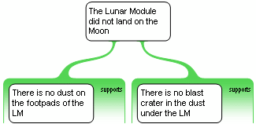
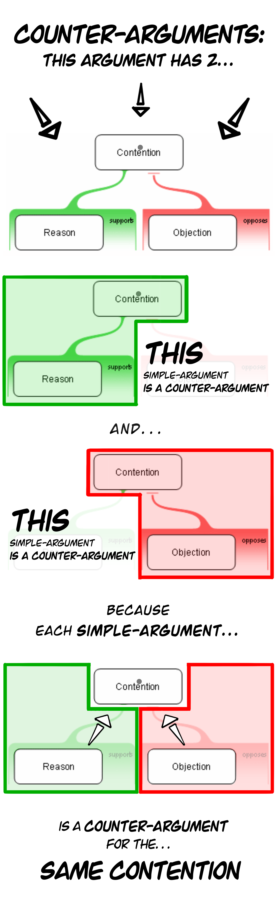
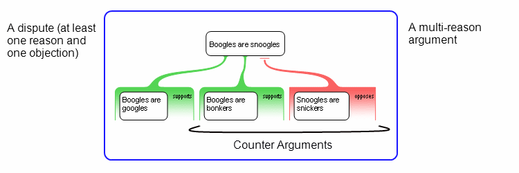
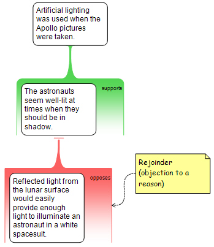

# Argument Mapping: Terms
- **claim**
   - <u>an idea</u> that somebody says is true
- **contention**
   - <u>a claim</u> that is supported by evidence.
- **reason**
   - <u>evidence</u> (supporting the claim)
   - eg, a “grouping” of claims to prove contention
   - A reason is just a set of claims, working together, to prove that, another claim is true. 
- **objection** 
   - <u>evidence</u> that opposes the claim
   - eg, a “grouping” of claims to disprove contention
   - An objection is just a set of claims, working together, to prove that, another claim is false. 
- **evidence**
   - a <u>set of claims, that work together, to prove that </u>another claim++ is true or false. 
---
- **simple argument**
   - an argument that has  
      **<u>a single piece of evidence</u>**  
      bearing upon  
      **<u>a single</u>** contention.  
   - Also
      - a contention with  
         a <u>single reason</u> for it or,  
         a <u>single objection</u> against it.
   - What makes an argument simple?
      - It’s an argument that has  
         **<u>just one</u>** contention &  
         **<u>just one</u>**  piece of evidence ➜
---
- **premise**
   - a <u>claim</u> inside of or part of  
      a reason or objection ⚠
- **co-premise**
   - a <u>claim</u> inside of or part of  
      a reason or objection  
      <u>that works with</u> another claim (co-premise)  
      to prove the contention. 
- **hidden premise**
   - a <u>co-premise</u> that isn’t stated in a reason or objection
---
- **multi-reason argument**
   - an argument that has  
      <u>at least two distinct pieces of evidence</u>  
      <u>for the same</u> contention ➜ 
   - For example… 
      - This is a multi-reason argument…  
         Can be two separate reasons…  
           
         it presents two separate reasons for the **<u>same contention</u>** ➜ 
      - This is a multi-reason argument…  
         Can be a reason and objection…  
           
         - This multi-reason argument is a dispute - there is evidence both for and against the conclusion. ➜ 
- **counter argument**
   - a simple argument that has  
      <u>the same</u> contention  
      <u>as another</u> simple argument  
      **<u>but opposing</u>** evidence.
   - These are counter arguments…  
     
   - These are counter arguments…  
     
   - A counter-argument IS ALSO…
      - an objection to a reason's contention, and/or vice versa. ➜ 
      - The things that <u>are inside</u> disputes
- **dispute**
   - an argument that has  
      <u>at least one</u>  reason for <u>AND</u>  
      <u>at least one</u>  objection against,  
      <u>the same</u>  contention ➜
   - A dispute is also…
      - A multi-reason argument ➜ 
- **strange bedfellows**
   - two co-premises  
      mapped inside <u>the same</u> reason  
      that actually, belong in  
      <u>different</u> reasons
- **stranded co-premise**
   - two co-premises  
      mapped inside <u>different</u> reasons  
      that actually belong in  
      <u>the same</u> reason
---
- **multi-layer argument**
   - An argument where  
      one reason provides evidence <u>in support of</u>  
      another reason.
   - A multi-layer argument is also
      - an argument that has evidence for evidence
      - An argument with  
         evidence that proves  
         other evidence
      - An argument that has  
         layers of evidence  
         supporting other evidence
      - an argument that provides evidence for other evidence
      - An argument that has  
         reasons or objections  
         providing evidence for  
         other reasons or objections
      - an argument in which there are reasons or objections bearing upon reasons or objections ➜ 
- **main contention**
   - the only contention  
      <u>that is not also</u> a premise  
      <u>in another</u> simple argument.
   - eg…
      - top level contention
- **main reason**
   - the first and most important reason, at the top level, that seeks to provide evidence that the contention is true ▹▹ 
- **secondary reason**
   - evidence that proves  
      a premise  
      in the primary reason
   - function:
      - the secondary reason  
         is a simple argument ➜
      - the secondary reason’s contention  
         is one of the premises  
         in the primary reason ➜
      - that means…
      - a secondary reason provides support for / proves the primary reason ➜
- **main premise**
   - the <u>first and most important</u> claim in a reason or objection ▹▹ 
- supporting evidence
   - <u>a layer of evidence</u>  
      that supports/proves  
      <u>other evidence</u>
+ supporting evidence types
   - **reason for a reason**
      - a reason <u>that supports</u> another reason.
      - function:
         - Evidence that proves another reason
      - <u>The contention</u> of a supporting reason  
         <u>is a premise</u> in upper reason. ➜ 
         - 2 simple arguments mapped separately
            
         - Mapped as a single multi-layer argument
            
   - **reason for an objection**
      - a reason <u>that supports</u> an objection
      - function:
         - Evidence that backs up an objection
         - provides evidence that the objection is a good one. ➜
   - **rejoinder**
      - <u>an objection</u> to a reason
      - function:
         - provides evidence that a reason is not good evidence for the argument above it.  
              
      - 2 kinds of rejoinders
         - first kind provides evidence that one of the claims (co-premises) in the reason is not true  
              
         - second kind provides evidence that the claims (co-premise(s), even if true, don't provide good evidence for their contention  
              
   - **rebuttal**
      - an objection to an objection
      - function:
         - A rebuttal provides evidence that an objection is not a good objection ➜
            - eg. not good evidence against its contention.
         - A rebuttal (if good) "cancels out" rather than supports the first objection. ➜
         - A rebuttal basically says "the first objection is not a good objection." ➜
- **chains of reasoning**
   - a multi-layer argument  
      with more than two layers
   - a chain of reasoning is also…
      - a multi-layer argument
      - At least two simple arguments combined into a single, multi-level argument
         - 2 Separate arguments  
              
         - 2 Separate arguments combined into one argument  
              
         
- **argument web**
   - an argument that is both  
      <u>a multi-reason</u> argument, and  
      <u>a multi-layer</u> argument.
---
- premise objection
   - an objection to a  
      stated <u>premise</u>  ▹▹ 
- inference objection
   - an objection to  
      **<u>an unstated</u>** premise ▹▹ 
   - Note… 
      - an inference objection is not aimed at any specific premise. ▹▹ 
      - An inference objection is not aimed at a visible premise.   
         **It is aimed at at a premise that has not yet been stated.** ▹▹ 
- premise rebuttal
   - an objection to  
      another stated objection
   - Difference between a “premise objection” vs “premise rebuttal”?
      - any objection to a premise is a premise objection ▹▹ 
- inference rebuttal
   - an objection to  
      another, unstated objection
---
- 4 Kinds of multi-layer arguments ➜
   - reason for a reason, 
   - reason for an objection, 
   - rejoinder
   - rebuttal
- support vs co-premise ➜ 
- multi-layer arguments have multiple contentions  ➜
---
+ #### Misc
   - a reason is made up of at least 2 distinct claims
      - every reason and objection is made up of at least two distinct claims, known as co-premises ⚠
   - In this passage, there is <u>only 1 reason</u> to believe… but <u>there are 2 claims</u> in that reason...  ⚠
      - In this passage, <u>there is only one reason</u> to believe the contention, <u>but there are two distinct claims in that reason</u>, i.e., two distinct premises. 
         - Eg, there is only one piece of “evidence”…
            - a reason is evidence.
         - EG, but there are two distinct claims in that ‘evidence’
            - eg, there are two co-premises
   - If both are true you have a ‘reason to believe’ 
      - If both premises are true, you have a <u>reason</u><u> to believe</u> the claim  ⚠️ 
   - argument mapping
      - Argument mapping is about making the reasoning <u>explicit</u> ⚠
      - When you hide co-premises, <u>you leave it up to your reader</u> to figure it out. ⚠